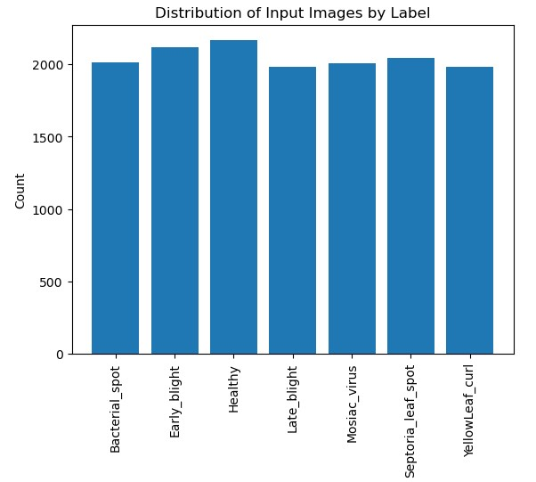
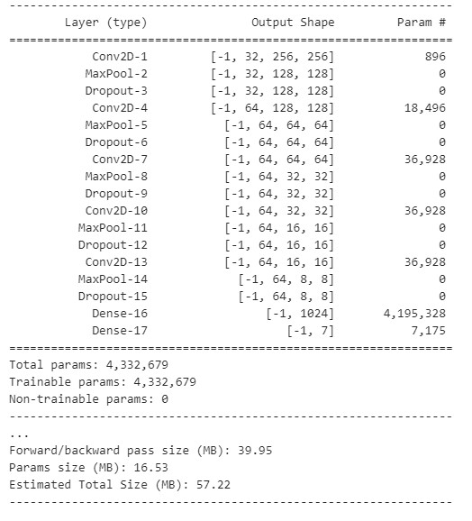
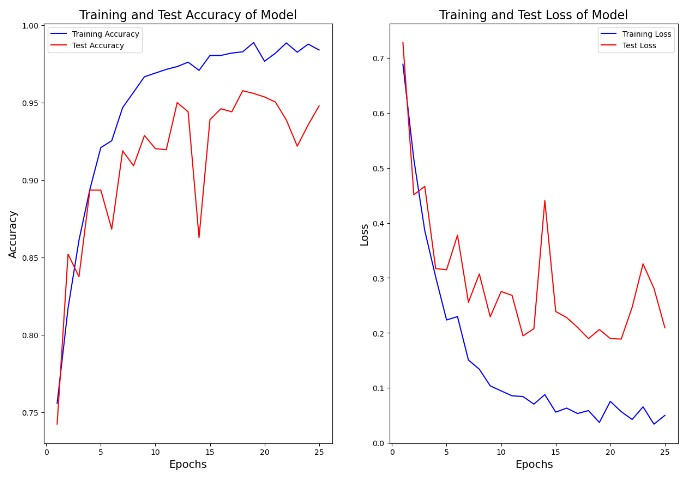
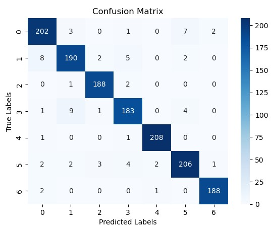
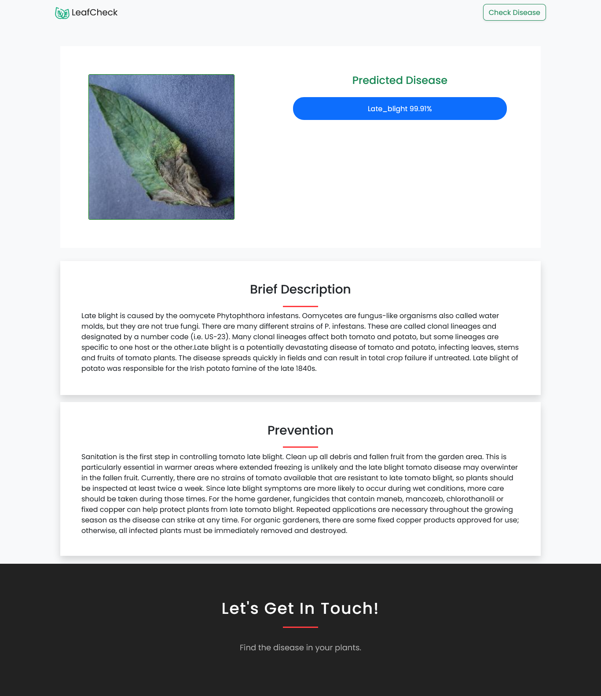

# LeafCheck: Tomato Leaf Disease Identification System using Convolutional Neural Network (CNN)

This project aims to develop a web application that can identify Tomato leaf diseases using Convolutional Neural Networks (CNNs). The application takes images of tomato leaf as input and predicts the presence of diseases in those leafs.

## Requirements:
To run the code in this project, you will need the following libaries:
- Python 3.7+
- Pytorch
- Numpy
- Pandas
- Matplotlib
- Flask
- Scikit-learn

## Dataset
The dataset used in this project is a combination of publicly avaiable dataset called the PlantVillage dataset and some collected through own smartphone. The dataset can be downloaded from the [Tomato Custom Dataset](https://www.kaggle.com/datasets/saurabstha5/tomato-custom-dataset)

## Model Architecture

We developed a CNN model that consists of multiple convolutional layers followed by max pooling layers and dense layers. The model was trained on the above dataset using the Pytorch library in Python. The trained model achieved an accuracy of over 94% on the test set.

### Model Summary

## Result
The trained model achieved an accuracy of over 94% on the test set. This is a promising result that suggests that the model is able to accuractely identify plant diseases based on input images.

**confusion matrix**

## Running the code
To train the model, simply run the `final_model.py` file in the `Web app/model/final_model.py`. The trained model will be shaved as an pth file in the `model` diretory.

To use the trained model to make predictions on new images, run the `app.py`. You can modify this file to specify the path to the input image.

## Output

**Home page**
.png)

**Output Page**

## Conclusion
In conclusion, this project demonstrates the use of CNNs for tomato leaf disease identification. The trained model achieved a high accuracy on the test set, suggesting that it has the potential to be used as a tool for diagnosing plant diseases. Further research could explore the use of more advanced architectures or techniques to improve the performance of the model.
